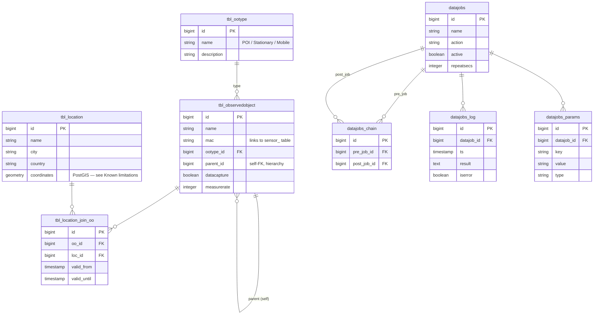

# Data schema — `smartmonitoring_airquality`

Reverse-engineered from the live database. Source of truth is the
running Postgres instance; this document is a navigable summary.

## Cluster overview

PostgreSQL **13** instance running in Docker (see `docker-compose.yml`).
Eight databases live in the cluster — only one matters for the
dashboard:

| Database                       | Owner                       | Purpose                              |
| ------------------------------ | --------------------------- | ------------------------------------ |
| **`smartmonitoring_airquality`** | `smartmonitoring_airquality` | Air-quality measurements (this app). |
| `data_environmental`           | `data_environmental`        | Sibling project (out of scope).      |
| `smartdatalyser`               | `smartdatalyser`            | Sibling project (out of scope).      |
| `smartdataporter`              | `smartdataporter`           | Sibling project (out of scope).      |
| `smartmonitoring_test`         | `smartmonitoring_test`      | Test instance (out of scope).        |
| `smartuser`, `postgres`        | —                           | Default / utility databases.         |

The remaining content of this document concerns
`smartmonitoring_airquality` only.

## Domain in one paragraph

The dump models **air-quality measurements** captured by SENSORpi units
(Raspberry-Pi based sensors), grouped under "observed objects"
(`tbl_observedobject`) of three types: Point of Interest, stationary
sensor, mobile sensor. Each sensor unit gets its own time-series
table named after its MAC address (e.g. `sensor_000aeb8337ac`). Tables
named `tbl_*` hold reference and metadata. Tables under `datajobs*`
implement a small scheduler for periodic data jobs.

## Schemas

| Schema           | Description                                              |
| ---------------- | -------------------------------------------------------- |
| `public`         | PostGIS metadata views + one stray legacy table.         |
| `smartmonitoring` | All application tables, views and time-series sensor data. |

## Entity-Relationship Diagram

Only declared foreign keys are drawn. Several columns are *soft*
references (no FK constraint) — these are noted in the "Notable
columns without FK" section.



## Sensor (time-series) tables

Each observed object of type "stationary" or "mobile" (`ootype_id` in
{2, 3}) has its **own** time-series table. The table name is the MAC
address of the device, lowercased, hyphens removed, prefixed with
`sensor_`. Example: MAC `00-0A-EB-83-37-AC` → table
`smartmonitoring.sensor_000aeb8337ac`.

**Three distinct schemas exist** across the 22 sensor tables (no
common parent table — they're not partitions of a logical superclass):

### Shape A — SENSORpi standard (15 tables, ~1M rows total)

Used by: `sensor_000aeb8337ac`, `sensor_74da38543e8d`,
`sensor_74da38543e94`, `sensor_801f02b31e0d`, plus 11 mostly-empty
`sensor_b827eb*` tables.

| Column                 | Type                | Notes                                  |
| ---------------------- | ------------------- | -------------------------------------- |
| `id`                   | bigint              | PK.                                    |
| `ts`                   | timestamp (no tz)   | Measurement time. **No index** — slow on big tables. |
| `temp1`, `temp2`, `temp3` | float8           | °C. Three internal probes.             |
| `pm2_5`, `pm10_0`      | float8              | Particulate matter, ppm.               |
| `co2`                  | float8              | ppm.                                   |
| `pos`                  | PostGIS geometry    | Sensor position. Inaccessible without PostGIS — see *Known limitations*. |
| `pos_accuracy`         | float8              | meters.                                |
| `pos_altitude`, `pos_altitude_accuracy` | float8 | m above sea level.                  |
| `pos_heading`, `pos_speed` | float8          | For mobile sensors.                    |
| `inn_temp`, `inn_pres`, `inn_hum` | float8   | Inside-housing climate.                |
| `measurement_process`  | varchar             | Process tag (free text).               |
| `synced`               | boolean **NOT NULL** | Replication flag.                     |

### Shape B — High-resolution PM sensor (1 table)

Used by: `sensor_781c3ce6ad3c` (424 rows).

| Column           | Type             | Notes                                    |
| ---------------- | ---------------- | ---------------------------------------- |
| `id`, `ts`       | bigint, timestamp | PK + measurement time.                  |
| `pos`            | PostGIS geometry  |                                          |
| `temp`, `hum`, `pres` | float8       | Single-probe climate.                    |
| `mass_pm1_0`, `mass_pm2_5`, `mass_pm4`, `mass_pm10` | float8 | Mass concentration per size class.   |
| `number_pm0_5`, `number_pm1_0`, `number_pm2_5`, `number_pm4`, `number_pm10` | float8 | Particle count per size class. |

### Shape C — External feed, lat/lon as separate floats (1 table)

Used by: `sensor_pollish_external` (68 rows). Polish/external data
provider; coordinates are decomposed (not PostGIS), and CAQI is the
Common Air Quality Index.

| Column                   | Type      | Notes                |
| ------------------------ | --------- | -------------------- |
| `id`, `ts`               | bigint, timestamp |              |
| `latitude`, `longitude`  | float8    | Plain decimals.      |
| `installation_id`        | float8    |                      |
| `caqi`                   | float8    | Common AQI value.    |
| `pm2_5`, `pm10_0`, `pm1` | float8    | Particulate matter.  |
| `temp1`                  | float8    | °C.                  |
| `inn_hum`, `inn_pres`    | float8    | Climate.             |

### Shape D — Anomalous duplicate (1 table)

`sensor_b827eb0fae5c` (10,680 rows). Same columns as Shape A but with
a single multi-column index that effectively re-stores the whole row.
Likely a migration artifact — treat as Shape A.

### "External sensor 47589"

`ext_sensor_47589` (54 rows) is **not** a per-MAC time-series table —
it imports data from a third-party station (note `manufacturer`,
`country`, `exact_location` columns). Schema differs from A/B/C.

## Reference / metadata tables (`smartmonitoring`)

### `tbl_ootype` — observed-object types (enum-like, 3 rows)

| id | name                          | description |
| -- | ----------------------------- | ----------- |
| 1  | Point Of Interest             | Notable place. |
| 2  | Stationärer Luftqualitätssensor | Stationary SENSORpi. |
| 3  | Mobiler Luftqualitätssensor   | Mobile SENSORpi. |

### `tbl_observedobject` — devices and POIs (40 rows)

The hub of the application graph. Each row is either a POI or a
sensor. The `mac` column carries the device MAC; the matching sensor
table is `sensor_<mac_normalized>`. `parent_id` is a self-reference
(devices grouped under a parent location/asset).

### `tbl_location` — physical locations (19 rows)

Address + PostGIS `coordinates` column. Country, city, postcode, etc.
Joined to `tbl_observedobject` via `tbl_location_join_oo` which
carries `valid_from`/`valid_until` — locations can change over time.

### `tbl_datatype` — column-as-row metadata (38 rows)

A registry describing every sensor data column: name, type, unit,
nullability, default. Lets the application discover schema at runtime.
`ootype_id` ties each datatype to an ootype.

### `tbl_metatype`

Same shape as `tbl_datatype` but for metadata about the observed
object itself rather than its measurements. Currently empty.

### `tbl_navigationroute` (39 rows), `tbl_routes_planned` (0 rows)

Route definitions for mobile sensors. `tbl_routes_planned.pos` is a
PostGIS geometry.

### `tbl_systemconfiguration` (47 rows)

Key/value config store: `ckey`, `ctype`, `cvalue`, `active`.

### `schemes`, `schemes_visuals`, `schemes_activity`

Visualization-scheme definitions: a `scheme` groups `schemes_visuals`
(geometric primitives positioned by `x`/`y`/`width`/`height` and
linked to an `observedobject_id`) into a dashboard layout.
`schemes_activity` is a slim activity-log table with PM/temperature
samples.

### `datajobs`, `datajobs_chain`, `datajobs_log`, `datajobs_params`

Tiny scheduler. `datajobs` is the job definition; `datajobs_chain`
expresses ordering ("after job A finishes with checkkey/checkvalue,
run job B"); `datajobs_log` is the run history; `datajobs_params`
carries job-specific parameters as typed key/value rows.

## Views in `smartmonitoring`

| View                          | Purpose                                                |
| ----------------------------- | ------------------------------------------------------ |
| `view_oo_hierarchy`           | `tbl_observedobject` flattened with `depth`, `path`, `root_id` (recursive CTE). |
| `view_oo_without_locations`   | Observed objects that have **no** active location join. |

## Primary and foreign keys

**Every table has a single-column `id` PK** (bigint, with sequences on
all `smartmonitoring` tables except `tbl_datatype`/`tbl_metatype`/
`tbl_ootype` which use manually assigned IDs).

Declared foreign keys (8 total):

| From                              | Column           | To                          | Action        |
| --------------------------------- | ---------------- | --------------------------- | ------------- |
| `datajobs_chain`                  | `pre_job_id`     | `datajobs.id`               | restrict      |
| `datajobs_chain`                  | `post_job_id`    | `datajobs.id`               | restrict      |
| `datajobs_log`                    | `datajob_id`     | `datajobs.id`               | restrict      |
| `datajobs_params`                 | `datajob_id`     | `datajobs.id`               | restrict      |
| `tbl_location_join_oo`            | `oo_id`          | `tbl_observedobject.id`     | restrict      |
| `tbl_location_join_oo`            | `loc_id`         | `tbl_location.id`           | restrict      |
| `tbl_observedobject`              | `ootype_id`      | `tbl_ootype.id`             | restrict      |
| `tbl_observedobject`              | `parent_id`      | `tbl_observedobject.id`     | restrict      |

### Notable columns without an FK constraint (soft references)

These behave as foreign keys at the application layer but lack
database-level enforcement:

- `tbl_datatype.ootype_id` → `tbl_ootype.id`
- `tbl_metatype.ootype_id` → `tbl_ootype.id`
- `schemes_visuals.schemes_id` → `schemes.id`
- `schemes_visuals.observedobject_id` → `tbl_observedobject.id`
- `schemes_visuals.parent_id` → `schemes_visuals.id` (self)
- `schemes_activity.observedobject_id` → `tbl_observedobject.id`
- `tbl_navigationroute.parent` → `tbl_navigationroute.id` (self)
- `tbl_observedobject.mac` → `sensor_<normalized mac>` table name (a
  *naming convention*, not a column FK)

## Known limitations of the dev setup

1. **No `ts` index on sensor tables.** Time-range queries on
   `sensor_000aeb8337ac` (248k rows) and `sensor_74da38543e94` (171k
   rows) currently scan the whole table. If dashboard latency becomes
   noticeable, add: `CREATE INDEX ON smartmonitoring.sensor_<mac> (ts);`
2. **Trust authentication.** `pg_hba.conf` is fully open inside the
   dev container — fine for local-only, not for any deployment.

## Locale repair (background)

The dump was created on a Windows install where every database had
`datcollate = 'German_Germany.1252'`. Linux glibc-based Postgres images
refuse to open such databases. `scripts/setup-db.sh` rewrites the
catalog to `C` collation via a one-shot single-user `UPDATE pg_database`
before the main container starts, which lets us use the PostGIS image
(`imresamu/postgis:13-3.5`, arm64-compatible) and read `geometry`
columns with `ST_*` functions:

```sql
SELECT id, name, ST_AsText(coordinates) FROM smartmonitoring.tbl_location;
SELECT ST_X(pos) AS lon, ST_Y(pos) AS lat
FROM smartmonitoring.sensor_b827eb0fae5c
WHERE pos IS NOT NULL LIMIT 10;
```

## Row counts (snapshot)

| Table                         | Rows    |
| ----------------------------- | ------- |
| `sensor_000aeb8337ac`         | 248,651 |
| `sensor_74da38543e94`         | 171,078 |
| `sensor_74da38543e8d`         |  58,168 |
| `sensor_801f02b31e0d`         |  57,566 |
| `sensor_b827eb0fae5c`         |  10,680 |
| `sensor_b827eb1f5f13`         |   1,761 |
| `sensor_781c3ce6ad3c`         |     424 |
| `sensor_pollish_external`     |      68 |
| `ext_sensor_47589`            |      54 |
| `tbl_systemconfiguration`     |      47 |
| `tbl_observedobject`          |      40 |
| `tbl_navigationroute`         |      39 |
| `tbl_datatype`                |      38 |
| `schemes_activity`            |      20 |
| `tbl_location`                |      19 |
| `tbl_location_join_oo`        |      19 |
| `schemes_visuals`             |       7 |
| `tbl_ootype`                  |       3 |
| `schemes`                     |       1 |

(Remaining `sensor_b827eb*` tables are empty.)

The earliest sensor reading is **2025-07-16 13:41:16** and the latest
is **2025-11-11 11:09:39** (range for `sensor_000aeb8337ac` — the
busiest sensor).
