# Full data schema — `smartmonitoring_airquality`

> **Source of truth:** the *live* PostgreSQL 13.22 + PostGIS instance running in
> the Docker container `usability-db`. Every statement below was verified
> against the running database via `information_schema` / `pg_catalog`
> introspection on **2026-05-29**. Each section quotes the exact SQL used so the
> work is reproducible.
>
> This document **supersedes and corrects** [`data_schema.md`](data_schema.md).
> A list of concrete divergences from the old doc is in
> [§F.4](#f4-where-this-diverges-from-the-old-data_schemamd).
>
> Connect with:
> ```bash
> docker compose up -d            # if not already running
> docker exec -it usability-db psql -U smartmonitoring_airquality -d smartmonitoring_airquality
> ```

---

## A) Executive summary

This is the **air-quality measurement** database for the SENSORpi platform — a
fleet of Raspberry-Pi-based air-quality sensors (stationary and mobile) plus a
few imported third-party feeds. It lives in one cluster database,
`smartmonitoring_airquality`, whose application objects are all in the
**`smartmonitoring`** schema (the `public` schema holds only PostGIS metadata
plus one stray legacy join table). The schema contains **35 tables and 2 views**:
a small set of `tbl_*` reference/metadata tables centred on
`tbl_observedobject` (the device/place registry), a tiny `datajobs*` scheduler
that pulls one external sensor.community feed, three `schemes*` tables for a
legacy dashboard-layout feature, and — the defining quirk — **one time-series
table per sensor**, named after the device's MAC address
(`sensor_<mac>`). There are **18 such `sensor_*` tables** (plus
`ext_sensor_47589`); **8 of the 18 hold data and 10 are empty** registered
devices (all `b827eb*` mobiles). Foreign keys are sparse (**8 declared FKs**); most cross-table links
are *implicit* naming/ID conventions with no constraint. Measurements span
**2023-05-02 → 2025-12-01**, dominated by four stationary sensors logging
roughly every 30 s. The database directory was created on a Windows install and
its locale was repaired to `C` (see CLAUDE.md); collation is `C` everywhere.

---

## B) Logical data model

Declared foreign keys are drawn solid. **Implicit / no-FK** relationships
(verified by sample joins and orphan counts in [§D](#d-relationships)) are drawn
dashed and labelled `implicit`.

```mermaid
erDiagram
    tbl_ootype                ||--o{ tbl_observedobject       : "ootype_id (FK)"
    tbl_observedobject        ||--o{ tbl_observedobject       : "parent_id (FK, UNUSED)"
    tbl_observedobject        ||--o{ tbl_location_join_oo     : "oo_id (FK)"
    tbl_location              ||--o{ tbl_location_join_oo     : "loc_id (FK)"
    datajobs                  ||--o{ datajobs_chain           : "pre/post_job_id (FK)"
    datajobs                  ||--o{ datajobs_log             : "datajob_id (FK)"
    datajobs                  ||--o{ datajobs_params          : "datajob_id (FK)"

    tbl_ootype                ||..o{ tbl_datatype             : "ootype_id (implicit)"
    tbl_ootype                ||..o{ tbl_metatype             : "ootype_id (implicit, empty)"
    schemes                   ||..o{ schemes_visuals          : "schemes_id (implicit)"
    tbl_observedobject        ||..o{ schemes_visuals          : "observedobject_id (implicit)"
    schemes_visuals           ||..o{ schemes_visuals          : "parent_id (implicit self)"
    tbl_observedobject        ||..o{ SENSOR_per_mac           : "mac -> sensor_<mac> (implicit name)"
    tbl_observedobject        ||..o{ tbl_card_join_oo         : "observedobject_id (implicit, 0 rows)"
    tbl_observedobject        ||..o{ schemes_activity         : "devid MAC prefix (implicit, 17/20)"
    schemes_visuals           ||..o{ schemes_visuals          : "part1/part2 (implicit self, connectors)"
    datajobs                  ||..o{ ext_sensor_47589         : "feeds via HTTP import (implicit)"

    tbl_observedobject {
        bigint   id PK
        varchar  name
        varchar  mac          "implicit link to sensor_<mac>"
        bigint   ootype_id    FK
        bigint   parent_id    "self-FK, UNUSED (0/40)"
        boolean  datacapture
        integer  measurerate
        varchar  ip
    }
    tbl_ootype {
        bigint id PK          "manual id, no sequence"
        varchar name          "POI / Stationary / Mobile"
        varchar description
    }
    tbl_location {
        bigint   id PK
        varchar  name
        varchar  city
        varchar  country
        geometry coordinates  "geometry(PointZ,4326)"
    }
    tbl_location_join_oo {
        bigint    id PK
        bigint    oo_id       FK
        bigint    loc_id      FK
        timestamp valid_from  "all NULL"
        timestamp valid_until "all NULL"
    }
    tbl_datatype {
        bigint  id PK         "manual id, no sequence"
        varchar name          "describes a sensor column"
        varchar type
        varchar unit
        bigint  ootype_id     "implicit -> tbl_ootype"
    }
    SENSOR_per_mac {
        int_or_bigint id PK
        timestamp ts          "no usable index"
        float8 pm2_5
        float8 pm10_0
        geometry pos          "SRID 4326; NULL on stationary"
    }
    datajobs {
        bigint  id PK
        varchar name
        varchar action        "ReadData / WriteData"
        boolean active
        integer repeatsecs
    }
    datajobs_chain {
        bigint id PK
        bigint pre_job_id   FK
        bigint post_job_id  FK
        varchar checkvalue
    }
    datajobs_log  { bigint id PK
        bigint datajob_id FK
        timestamp ts
        boolean iserror }
    datajobs_params { bigint id PK
        bigint datajob_id FK
        varchar key
        varchar value }
    schemes { bigint id PK
        varchar name }
    schemes_visuals { bigint id PK
        bigint schemes_id
        bigint observedobject_id
        bigint parent_id }
    schemes_activity { bigint id PK
        bigint observedobject_id "100% NULL"
        varchar devid           "real key: mac_script" }
    ext_sensor_47589 { int id PK
        timestamp ts
        float8 lat
        float8 lon
        varchar manufacturer }
```



---

## A/overview) Cluster, schemas, relations

### Databases in the cluster

```sql
SELECT d.datname, pg_catalog.pg_get_userbyid(d.datdba) AS owner,
       d.datcollate, d.datctype, pg_size_pretty(pg_database_size(d.datname)) AS size
FROM pg_database d ORDER BY pg_database_size(d.datname) DESC;
```

| datname | owner | collate | ctype | size |
| --- | --- | --- | --- | --- |
| `data_environmental` | data_environmental | C | C | 620 MB |
| `smartmonitoring_test` | smartmonitoring_test | C | C | 422 MB |
| **`smartmonitoring_airquality`** | smartmonitoring_airquality | C | C | **285 MB** |
| `smartuser` | smartuser | C | C | 8.2 MB |
| `smartdataporter` | smartdataporter | C | C | 7.9 MB |
| `smartdatalyser` | smartdatalyser | C | C | 7.9 MB |
| `postgres` | smartmonitoring_test | C | C | 7.8 MB |
| `template0`, `template1` | smartmonitoring_test | C | C | 7.8 MB ea. |

Nine catalog rows total (seven real databases + two templates). Collation is
`C` on **every** database — the `German_Germany.1252` locale was already
repaired. Only `smartmonitoring_airquality` matters for the dashboard; the rest
are sibling projects, out of scope.

### Schemas in `smartmonitoring_airquality`

```sql
SELECT n.nspname, pg_catalog.pg_get_userbyid(n.nspowner) AS owner
FROM pg_namespace n
WHERE n.nspname NOT LIKE 'pg_%' AND n.nspname <> 'information_schema';
```

| schema | owner | contents |
| --- | --- | --- |
| `public` | smartmonitoring_test | PostGIS only: `spatial_ref_sys` (8 500 rows), views `geometry_columns` & `geography_columns`, **+ one stray table** literally named `"smartmonitoring.tbl_card_join_oo"` (0 rows, no PK). |
| `smartmonitoring` | smartmonitoring_airquality | All application tables, views and per-sensor time series. |

### All relations with size & estimated rows

```sql
SELECT n.nspname AS schema, c.relname, c.relkind, c.reltuples::bigint AS est_rows,
       pg_size_pretty(pg_total_relation_size(c.oid)) AS total_size
FROM pg_class c JOIN pg_namespace n ON n.oid = c.relnamespace
WHERE n.nspname IN ('public','smartmonitoring') AND c.relkind IN ('r','v','m','f','p')
ORDER BY n.nspname, pg_total_relation_size(c.oid) DESC;
```

Exact counts (cheap — DB is small) via a generated `UNION ALL` + `\gexec`:

```sql
SELECT string_agg(format('SELECT %L::text AS tbl, count(*)::bigint AS exact_rows FROM %I.%I',
                  relname,'smartmonitoring',relname), E'\nUNION ALL ' ORDER BY relname)
       || E'\nORDER BY exact_rows DESC'
FROM pg_class c JOIN pg_namespace n ON n.oid=c.relnamespace
WHERE n.nspname='smartmonitoring' AND c.relkind='r'
\gexec
```

| schema.table | kind | exact rows | total size |
| --- | --- | ---: | ---: |
| `smartmonitoring.sensor_000aeb8337ac` | table | 248 651 | 94 MB |
| `smartmonitoring.sensor_74da38543e94` | table | 171 078 | 65 MB |
| `smartmonitoring.sensor_74da38543e8d` | table | 58 168 | 22 MB |
| `smartmonitoring.sensor_801f02b31e0d` | table | 57 566 | 22 MB |
| `smartmonitoring.sensor_b827eb0fae5c` | table | 10 680 | 7.6 MB |
| `smartmonitoring.sensor_b827eb1f5f13` | table | 1 761 | 888 kB |
| `smartmonitoring.sensor_781c3ce6ad3c` | table | 424 | 112 kB |
| `smartmonitoring.sensor_pollish_external` | table | 68 | 32 kB |
| `smartmonitoring.ext_sensor_47589` | table | 54 | 32 kB |
| `smartmonitoring.tbl_systemconfiguration` | table | 46 | 64 kB |
| `smartmonitoring.tbl_navigationroute` | table | 43 | 64 kB |
| `smartmonitoring.tbl_observedobject` | table | 40 | 40 kB |
| `smartmonitoring.tbl_datatype` | table | 38 | 32 kB |
| `smartmonitoring.schemes_activity` | table | 20 | 16 kB |
| `smartmonitoring.tbl_location` | table | 19 | 32 kB |
| `smartmonitoring.tbl_location_join_oo` | table | 19 | 24 kB |
| `smartmonitoring.schemes_visuals` | table | 7 | 16 kB |
| `smartmonitoring.datajobs_params` | table | 5 | 32 kB |
| `smartmonitoring.tbl_ootype` | table | 3 | 32 kB |
| `smartmonitoring.datajobs` | table | 2 | 32 kB |
| `smartmonitoring.schemes` | table | 1 | 16 kB |
| `smartmonitoring.datajobs_chain` | table | 1 | 32 kB |
| `smartmonitoring.datajobs_log` | table | 0 | 16 kB |
| `smartmonitoring.tbl_metatype` | table | 0 | 16 kB |
| `smartmonitoring.tbl_routes_planned` | table | 0 | 16 kB |
| `smartmonitoring.sensor_b827eb106867` … `…af9e82` (10 tables) | table | 0 | 16 kB ea. |
| `smartmonitoring.view_oo_hierarchy` | view | — | — |
| `smartmonitoring.view_oo_without_locations` | view | — | — |
| `public.spatial_ref_sys` | table | 8 500 | 7.2 MB |
| `public.geometry_columns` / `geography_columns` | view | — | — |
| `public."smartmonitoring.tbl_card_join_oo"` | table | 0 | 0 bytes |

Composition (`relname` pattern counts): **18** `sensor_*` tables, **1**
`ext_sensor_*`, **9** `tbl_*`, plus `datajobs`(+`_chain`/`_log`/`_params`),
`schemes`(+`_visuals`/`_activity`) = **35 tables + 2 views** in
`smartmonitoring`.

---

## C) Table reference

> No table or column **comments** exist except 16 *table-level* human labels on
> the sensor tables (see [§E](#e-the-sensor-table-shapes) and the data-quality
> note in [§F](#f-data-quality--anomalies)). The "Comment" column below is
> therefore only populated where one exists.
>
> Column facts come from:
> ```sql
> SELECT n.nspname, c.relname, a.attnum, a.attname,
>        format_type(a.atttypid,a.atttypmod) AS type, a.attnotnull,
>        pg_get_expr(ad.adbin,ad.adrelid) AS default, a.attidentity
> FROM pg_attribute a JOIN pg_class c ON c.oid=a.attrelid
> JOIN pg_namespace n ON n.oid=c.relnamespace
> LEFT JOIN pg_attrdef ad ON ad.adrelid=c.oid AND ad.adnum=a.attnum
> WHERE n.nspname IN ('public','smartmonitoring') AND c.relkind IN ('r','v','m')
>   AND a.attnum>0 AND NOT a.attisdropped ORDER BY 1,2,3;
> ```

**No identity columns** are used anywhere. "Key" below = PK / sequence-backed
`id`. Sequences confirmed via `pg_depend` (deptype `a`).

### `tbl_observedobject` — device & place registry (40 rows)

| Column | Type | Null | Default | Key |
| --- | --- | --- | --- | --- |
| id | bigint | NOT NULL | `nextval(seq)` | PK |
| datacapture | boolean | null | | |
| description | varchar(255) | null | | |
| icon | varchar(255) | null | | |
| manualcapture | boolean | null | | |
| name | varchar(255) | null | | |
| parent_id | bigint | null | | self-FK (unused) |
| ootype_id | bigint | NOT NULL | | FK → tbl_ootype |
| data_collection | varchar(50) | null | | |
| completed | boolean | null | | |
| mac | varchar(255) | null | | implicit → `sensor_<mac>` |
| ip | varchar(255) | null | | |
| collection_media | varchar(50) | null | | |
| meta_collection | varchar | null | | |
| measurerate | integer | null | | |
| isworker | boolean | null | | |
| measuredaylystart / measuredaylyend | varchar | null | | |
| api_actual_url | varchar | null | | |

The hub of the model. Each row is a **Point of Interest, a stationary sensor,
or a mobile sensor** (via `ootype_id`). For SENSORpi devices, `mac` is the
device MAC and the matching time-series table is `sensor_<mac normalized>`
(see [§D.1](#d1-tbl_observedobjectmac--sensor_mac-implicit-naming-convention)).
`parent_id` is a self-FK for grouping devices, but **it is NULL for all 40
rows** — the hierarchy feature is unused.

```sql
SELECT ootype_id, count(*) n, count(mac) with_mac FROM smartmonitoring.tbl_observedobject GROUP BY 1;
--  ootype 1 (POI):        1 row,  0 macs
--  ootype 2 (stationary): 19 rows, 4 macs (s01–s04); the other 15 are Polish/external stations
--  ootype 3 (mobile):     20 rows, 20 macs (m01–m20)
```

### `tbl_ootype` — observed-object types (3 rows, manual ids)

| id | name | description |
| --- | --- | --- |
| 1 | Point Of Interest | "Ein bemerkenswerter Ort" |
| 2 | Stationärer Luftqualitätssensor | "Stationärer SENSORpi zur Messung der Luftqualität" |
| 3 | Mobiler Luftqualitätssensor | "Mobiler SENSORpi zur Messung der Luftqualität" |

Enum-like lookup. `id` has **no sequence** (manually assigned). Columns:
`id, description, flatendsets, icon, name`.

### `tbl_location` — physical locations (19 rows)

| Column | Type | Null | Key |
| --- | --- | --- | --- |
| id | bigint | NOT NULL | PK / seq |
| apartment | varchar(255) | null | |
| city | varchar(255) | null | |
| *(attnum 4)* | — | — | **dropped column** |
| country | varchar(255) | null | |
| description | varchar(10485760) | null | |
| floor | varchar(255) | null | |
| housenumber | varchar(255) | null | |
| name | varchar(10485760) | NOT NULL | |
| postcode | varchar(255) | null | |
| room | varchar(255) | null | |
| street | varchar(10485760) | null | |
| coordinates | geometry(PointZ,4326) | null | |

Address + a PostGIS `coordinates` point (18 of 19 rows non-null). Joined to
`tbl_observedobject` through `tbl_location_join_oo`. Note the `varchar(10485760)`
("varchar(max)") fields and one **dropped column** at position 4 — both
legacy-migration artefacts. Sample: `id 1 = "SENSORpi Airquality s01", Minden,
POINT Z (8.903617 52.296892 0)`; `id 90 = "WSB Merito Universität", Gdansk`.

### `tbl_location_join_oo` — location ↔ object link (19 rows)

| Column | Type | Null | Key |
| --- | --- | --- | --- |
| id | bigint | NOT NULL | PK / seq |
| valid_from | timestamp | null | (all NULL) |
| valid_until | timestamp | null | (all NULL) |
| loc_id | bigint | null | **FK → tbl_location** |
| oo_id | bigint | null | **FK → tbl_observedobject** |

Time-bounded association table — but `valid_from`/`valid_until` are NULL in
every row, so it is effectively a static 1:1 map (`oo_id = loc_id` in all 19
rows). Covers the stationary/POI/station objects only; **no mobile sensor (oo
5–24) has a location row**, and oo 4 (`s04`) is also absent.

### `tbl_datatype` — column metadata / units dictionary (38 rows, manual ids)

| Column | Type | Null | Notes |
| --- | --- | --- | --- |
| id | bigint | NOT NULL | PK, **no sequence** |
| description, name | varchar(255) | null | column name being described |
| type | varchar(45) | null | e.g. `float8`, `timestamp` |
| unit | varchar(45) | null | e.g. `°C`, `ppm`, `hPa`, `%` |
| possiblevalues | varchar | null | |
| ootype_id | bigint | NOT NULL | implicit → tbl_ootype |
| isidentity, isnullable, isautoincrement | boolean | null | |
| refcollection … refonupdate | varchar | null | soft-reference hints (all empty/inert) |

A runtime registry describing the **Shape-A sensor columns**: 19 rows for
`ootype 2` (stationary) **and** 19 for `ootype 3` (mobile) = 38. Units: `temp*`
= °C, `pm2_5`/`pm10_0`/`co2` = ppm *(note: PM is conventionally µg/m³ — see
[§F](#f-data-quality--anomalies))*, `inn_pres` = hPa, `inn_hum` = %,
`pos_altitude` = "m ü N.N". The `pos` row is typed `float8` here (the real
column is `geometry`), and the registry misspells `measurement_proess` (the real
column is `measurement_process`).

### `tbl_metatype` — object-metadata registry (0 rows)

Empty. **17 columns** (not the same shape as `tbl_datatype`): it adds
`editable boolean NOT NULL` and `icon` and otherwise mirrors the `name/type/
unit/ootype_id/ref*` layout. `id` is manual (no sequence).

### `tbl_navigationroute` — UI menu tree (43 rows)

| Column | Type | Null | Key |
| --- | --- | --- | --- |
| id | bigint | NOT NULL | PK / seq |
| name | varchar(255) | null | e.g. `menu_object_list` |
| rfrom | varchar(255) | null | always `*` |
| rto | varchar(255) | null | target, e.g. `object/list.html` |
| parent | bigint | null | implicit self-ref (36/43 set) |
| active | boolean | null | default `true` |

Defines the web app's hierarchical navigation menu (not air-quality data).
`parent` builds the tree; it is actually used (36 of 43 rows have a parent).

### `tbl_systemconfiguration` — feature flags (46 rows)

`id (PK/seq), ckey varchar(255), ctype varchar(255), cvalue varchar(255),
active boolean NOT NULL default true`. Key/value config; rows are UI feature
toggles such as `func_object_list`, `func_objectmap_filter` with `active`
true/false. `ctype`/`cvalue` are blank in the sampled rows.

### `tbl_routes_planned` — planned mobile routes (0 rows)

`id (PK/seq), route_id text NOT NULL, step integer NOT NULL, pos
geometry(Point,4326) NOT NULL, description text`. Empty; would hold ordered
waypoints for mobile-sensor routes.

### `datajobs` (2), `datajobs_chain` (1), `datajobs_log` (0), `datajobs_params` (5)

A tiny **scheduler that ingests one external feed**. Verified contents:

- `datajobs`: `id, name, desc, action, active, start, stop, repeatsecs`.
  Row 1 `getData47589` (`action=ReadData`, `repeatsecs=300`), row 2
  `writeData47589` (`action=WriteData`).
- `datajobs_chain`: `id, pre_job_id (NN), post_job_id (NN), checkkey, checkvalue,
  checkchanged`. One row chains job 1 → job 2 when `checkvalue='finished'`.
- `datajobs_log`: `id, datajob_id (NN), result text, ts (NN, default now()),
  iserror`. Empty (no run history retained).
- `datajobs_params`: `id, key (NN), value (NN), datajob_id (NN), type (NN)`.
  Job 1 fetches `https://data.sensor.community/airrohr/v1/sensor/47589/` (GET);
  job 2 POSTs to a `SmartDataPorter` import endpoint with a JSON mapping that
  lands the response into **`ext_sensor_47589`**. This is the provenance of that
  table.

### `schemes` (1), `schemes_visuals` (7), `schemes_activity` (20)

Legacy **dashboard-layout** feature:

- `schemes`: `id, name`. One row: `overview`.
- `schemes_visuals`: 22 columns; positioned boxes/connectors
  (`x,y,width,height,type,kind,parent_id,…`) belonging to a `schemes_id` and an
  `observedobject_id`. All 7 rows belong to scheme 1 and reference
  `observedobject_id = 16`. Connector rows (`type='con'`) join two boxes via the
  self-referencing **`part1`/`part2`** columns (→ `schemes_visuals.id`). The
  free-text **`datasource`** column (4 rows) holds REST URLs that string-encode
  further references — two point at `schemes_activity` filtered by `devid`, one
  points at the `sensor_b827eb8b2a02` table by name — tying this legacy feature
  to live sensor data.
- `schemes_activity`: `id, observedobject_id, value, devid, ts (NN), pm2_5,
  pm10_0, temp`. A **legacy activity log** with PM/temperature samples from
  **2023-06 … 2024-02**. Crucially, `observedobject_id` is **NULL in all 20
  rows**; the real device key is the free-text `devid`
  (e.g. `B8-27-EB-8B-2A-02_/scripts/sds011.py`). Its MAC prefix resolves against
  `tbl_observedobject.mac` for 17 of 20 rows (oo 8 / `m04`); 3 rows reference an
  unregistered MAC (`CE-2F-71-6F-2D-A9`).

### `public."smartmonitoring.tbl_card_join_oo"` — stray legacy join table (0 rows)

`card_id bigint NOT NULL, observedobject_id bigint NOT NULL`. Lives in the
`public` schema with a **literal dotted name** (the `smartmonitoring.` prefix is
part of the table name, not a schema qualifier). **No primary key, no index, no
data.** A leftover from an aborted "card" feature.

### Views

```sql
SELECT pg_get_viewdef('smartmonitoring.view_oo_hierarchy', true);
SELECT pg_get_viewdef('smartmonitoring.view_oo_without_locations', true);
```

- **`view_oo_hierarchy`** — recursive CTE over `tbl_observedobject` adding
  `root_id`, `depth`, and a sortable `path` (`lpad(id,10,'0')` segments joined by
  `>`). Because `parent_id` is unused, every row has `depth = 0`,
  `root_id = id` — the "hierarchy" is currently flat.
- **`view_oo_without_locations`** — same recursive CTE, then
  `LEFT JOIN tbl_location_join_oo … WHERE oo_id IS NULL` to surface objects
  that have **no** location association (i.e. the mobile sensors + `s04`).

### Sensor / measurement tables

Documented as three+ distinct *shapes* in [§E](#e-the-sensor-table-shapes);
per-shape column tables and samples are there.

---

## D) Relationships

### Declared foreign keys (8)

```sql
SELECT c.relname AS tbl, con.conname, pg_get_constraintdef(con.oid)
FROM pg_constraint con JOIN pg_class c ON c.oid=con.conrelid
JOIN pg_namespace n ON n.oid=c.relnamespace
WHERE n.nspname IN ('smartmonitoring','public') AND con.contype='f';
```

| From.column | → To.column | On UPDATE | On DELETE | Cardinality |
| --- | --- | --- | --- | --- |
| `datajobs_chain.pre_job_id` | `datajobs.id` | CASCADE | CASCADE | many chains → 1 job |
| `datajobs_chain.post_job_id` | `datajobs.id` | CASCADE | CASCADE | many chains → 1 job |
| `datajobs_log.datajob_id` | `datajobs.id` | CASCADE | RESTRICT | many logs → 1 job |
| `datajobs_params.datajob_id` | `datajobs.id` | CASCADE | CASCADE | many params → 1 job |
| `tbl_location_join_oo.oo_id` | `tbl_observedobject.id` | CASCADE | RESTRICT | many joins → 1 object |
| `tbl_location_join_oo.loc_id` | `tbl_location.id` | CASCADE | RESTRICT | many joins → 1 location |
| `tbl_observedobject.ootype_id` | `tbl_ootype.id` | CASCADE | *NO ACTION* | many objects → 1 type |
| `tbl_observedobject.parent_id` | `tbl_observedobject.id` | CASCADE | *NO ACTION* | self (currently unused) |

> ⚠️ **Correction:** every FK is `ON UPDATE CASCADE` (the old doc said all were
> "restrict"). Delete behaviour varies: CASCADE for the `datajobs_chain`/
> `datajobs_params` links, RESTRICT for `datajobs_log` and both
> `tbl_location_join_oo` links, and the default NO ACTION for the two
> `tbl_observedobject` FKs.

### D.1 `tbl_observedobject.mac` → `sensor_<mac>` (implicit naming convention)

The headline quirk. Table name = `sensor_` + the MAC lower-cased with
separators removed. Verified directly:

```sql
WITH oo AS (
  SELECT id, name, mac, 'sensor_'||lower(translate(mac,'-:.','')) AS expected_table
  FROM smartmonitoring.tbl_observedobject WHERE mac IS NOT NULL),
tabs AS (SELECT c.relname FROM pg_class c JOIN pg_namespace n ON n.oid=c.relnamespace
  WHERE n.nspname='smartmonitoring' AND c.relkind='r' AND c.relname LIKE 'sensor\_%')
SELECT oo.id, oo.name, oo.mac, oo.expected_table, (t.relname IS NOT NULL) AS table_exists
FROM oo LEFT JOIN tabs t ON t.relname=oo.expected_table ORDER BY table_exists, oo.id;
```

**Evidence / cardinality:** 24 objects carry a MAC (`s01–s04`, `m01–m20`).
**16 have a matching `sensor_*` table; 8 do not** — the mobile devices
`m13`–`m20` (oo ids 17–24, MACs `B8-27-EB-BC-6F-21` … `B8-27-EB-FE-91-77`) are
registered but have **no time-series table**. The normalization handles the one
casing inconsistency in the data (`B8-27-EB-1F-5f-13`, note the lower-case
`5f`).

The reverse check (tables with no owning object):

```sql
-- sensor tables whose name matches no OO mac:
-- ext_sensor_47589, sensor_781c3ce6ad3c, sensor_pollish_external
```

So `sensor_781c3ce6ad3c` (a populated high-res sensor) has **no
`tbl_observedobject` row at all**, and the two external feeds are intentionally
unregistered.

### D.2 Implicit (no-FK) references — orphan-verified

```sql
SELECT 'tbl_datatype.ootype_id -> tbl_ootype', count(*) FILTER (WHERE o.id IS NULL), count(*)
  FROM smartmonitoring.tbl_datatype d LEFT JOIN smartmonitoring.tbl_ootype o ON o.id=d.ootype_id;
-- …repeated for each suspected link…
```

| Implicit reference | Orphans / total | Verdict |
| --- | --- | --- |
| `tbl_datatype.ootype_id` → `tbl_ootype.id` | 0 / 38 | ✅ valid soft FK |
| `tbl_metatype.ootype_id` → `tbl_ootype.id` | 0 / 0 | (table empty) |
| `schemes_visuals.schemes_id` → `schemes.id` | 0 / 7 | ✅ valid |
| `schemes_visuals.observedobject_id` → `tbl_observedobject.id` | 0 / 7 | ✅ valid (all = oo 16) |
| `schemes_visuals.parent_id` → `schemes_visuals.id` (self) | 0 / 7 | ✅ valid |
| `tbl_navigationroute.parent` → `tbl_navigationroute.id` (self) | 0 / 43 | ✅ valid (36 set) |
| `schemes_visuals.part1` → `schemes_visuals.id` (self) | 0 / 3 set | ✅ connector edge endpoint |
| `schemes_visuals.part2` → `schemes_visuals.id` (self) | 0 / 3 set | ✅ connector edge endpoint |
| `schemes_activity.observedobject_id` → `tbl_observedobject.id` | **20 / 20** | ❌ **dead — column is 100 % NULL** |
| `schemes_activity.devid` (MAC prefix) → `tbl_observedobject.mac` | 3 / 20 | ⚠️ mostly valid — 17/20 resolve to oo 8 (`m04`); 3 orphan (`CE-2F-…`) |
| `public."…tbl_card_join_oo".observedobject_id` → `tbl_observedobject` | 0 / 0 | (table empty) |

> ⚠️ **Correction:** the old doc lists
> `schemes_activity.observedobject_id → tbl_observedobject` as a soft reference.
> The `observedobject_id` column is NULL in every row, so that link is unusable.
> The actual device key is the `devid` string (MAC + script path); its MAC prefix
> **does** resolve against `tbl_observedobject.mac` for **17 of 20 rows** (all
> `B8-27-EB-8B-2A-02` = oo 8 / `SENSORpi m04`). Only the 3
> `CE-2F-71-6F-2D-A9_scripts/app.py` rows reference a MAC absent from the
> registry — so the `devid` link is *mostly* valid, not a dead end.

### D.3 Other domain links

- **`datajobs` → `ext_sensor_47589`** (process, not column): the scheduler pulls
  sensor.community sensor `47589` into the table (proved by `datajobs_params`).
- **`schemes_visuals.datasource`** (free-text REST URL on 4 rows) string-encodes
  references: two rows target `schemes_activity` filtered by `devid`
  (`…/records/schemes_activity?…filter=devid,eq,B8-27-EB-8B-2A-02_/scripts/sds011.py…`),
  and one targets the **`sensor_b827eb8b2a02`** table by name
  (`…/records/sensor_b827eb8b2a02?storage=smartmonitoring…`).
- **`tbl_observedobject` "Luftqualitätsmessstation NNNNN"** names embed external
  sensor IDs. Notably oo 102 = "Luftqualitätsmessstation **47589**" ↔
  `ext_sensor_47589`. Most of these station objects (oo 100–111, 91–93) are
  Gdańsk/Polish stations with no `mac` and no per-MAC table.
- **`sensor_pollish_external.installation_id`** is `10` (or NULL) for all 68
  rows — a single external installation, not a join key into this DB.

---

## E) The sensor-table shapes

`sensor_*` / `ext_sensor_*` tables grouped by exact column signature:

```sql
WITH sig AS (
  SELECT c.relname,
         string_agg(a.attname||':'||format_type(a.atttypid,a.atttypmod),', ' ORDER BY a.attnum) AS signature
  FROM pg_attribute a JOIN pg_class c ON c.oid=a.attrelid JOIN pg_namespace n ON n.oid=c.relnamespace
  WHERE n.nspname='smartmonitoring' AND c.relkind='r' AND a.attnum>0 AND NOT a.attisdropped
    AND (c.relname LIKE 'sensor\_%' OR c.relname LIKE 'ext\_sensor%')
  GROUP BY c.relname)
SELECT signature, count(*) n_tables, string_agg(relname,', ' ORDER BY relname) tables
FROM sig GROUP BY signature ORDER BY n_tables DESC;
```

This returns **six distinct signatures**, which collapse into **one dominant
SENSORpi shape (with 3 structural variants) + three specialty shapes**. The
old doc's "three shapes / 22 tables" was a simplification — see corrections.

### Shape A — SENSORpi air-quality (16 tables)

The canonical per-MAC shape. Recognise it by the signature
`{temp1, temp2, temp3, pm2_5, pm10_0, pos, pos_accuracy, pos_altitude,
pos_altitude_accuracy, pos_heading, pos_speed, inn_temp, inn_pres, inn_hum,
co2, measurement_process, synced}`.

| Column | Type | Null | Notes |
| --- | --- | --- | --- |
| id | integer **or** bigint | NOT NULL | PK; type differs per variant |
| ts | timestamp (no tz) | NOT NULL | measurement time — **no usable index** (see Indexes) |
| temp1, temp2, temp3 | float8 | null | °C; on stationary units only `temp1` is filled |
| pm2_5, pm10_0 | float8 | null | particulate matter (registry says "ppm") |
| pos | geometry | null | SRID 4326 POINT; **NULL on all stationary units** |
| pos_accuracy | float8 | null | m |
| pos_altitude, pos_altitude_accuracy | float8 | null | m |
| pos_heading, pos_speed | float8 | null | mobile only |
| inn_temp, inn_pres, inn_hum | float8 | null | housing climate (°C / hPa / %) |
| co2 | float8 | null | ppm |
| measurement_process | varchar | null | batch tag, e.g. `000aeb8337ac_20250716_01` |
| synced | boolean | NOT NULL* | replication flag (*nullable in the A3 variant) |

**Three structural variants** (same column set):

| Variant | Tables | `id` type | Column order | `synced` | `id` sequence |
| --- | --- | --- | --- | --- | --- |
| **A1 — standard** | 14: `74da38543e8d`, `74da38543e94`, `801f02b31e0d`, + the 11 `b827eb*` device tables | **integer** | canonical | NOT NULL | yes (except `b827eb8b2a02`, see §F) |
| **A2 — bigint id** | 1: `sensor_000aeb8337ac` | **bigint** | canonical | NOT NULL | yes |
| **A3 — migration artefact** | 1: `sensor_b827eb0fae5c` | bigint | **reordered** (pm/temp1 before ts) | **nullable** | **none** |

> The busiest table `sensor_74da38543e94` (171 k rows) is an **integer**-id A1
> table; only `sensor_000aeb8337ac` (248 k) is bigint. The A3 table
> `sensor_b827eb0fae5c` additionally carries a redundant all-columns index and
> duplicate rows (see §F).

```sql
SELECT id, ts, temp1, pm2_5, pm10_0, co2, inn_temp, inn_hum, measurement_process, synced
FROM smartmonitoring.sensor_000aeb8337ac ORDER BY ts LIMIT 4;
```
| id | ts | temp1 | pm2_5 | pm10_0 | co2 | inn_temp | inn_hum | measurement_process | synced |
|---|---|---|---|---|---|---|---|---|---|
| 1 | 2025-07-16 13:41:16.253 | 18.38 | 2.8 | 7.1 | 390 | 22.67 | 49.63 | 000aeb8337ac_20250716_01 | t |
| 2 | 2025-07-16 13:41:40.55 | 18.38 | 2.6 | 5 | 390 | 22.78 | 49.31 | 000aeb8337ac_20250716_01 | t |
| 3 | 2025-07-16 13:42:10.378 | 18.31 | 2.4 | 5.35 | 390 | 22.89 | 49.08 | 000aeb8337ac_20250716_01 | t |

(temp2/temp3 NULL, pos NULL — typical stationary record.)

```sql
SELECT id, ts, temp1, pm2_5, ST_AsText(pos) pos_wkt, pos_speed, synced
FROM smartmonitoring.sensor_b827eb0fae5c WHERE pos IS NOT NULL ORDER BY ts LIMIT 4;
```
| id | ts | temp1 | pm2_5 | pos_wkt | pos_speed | synced |
|---|---|---|---|---|---|---|
| 1202 | 2023-05-02 17:33:59.164 | 21.062 | 2.2 | POINT(8.9049844 52.2965075) | 0.0101 | *(null)* |
| 1199 | 2023-05-02 17:33:59.164 | 21.062 | 2.2 | POINT(8.9049844 52.2965075) | 0.0101 | *(null)* |
| 1200 | 2023-05-02 17:33:59.164 | 21.062 | 2.2 | POINT(8.9049844 52.2965075) | 0.0101 | *(null)* |

(Note the **three identical rows** — duplication artefact.)

### Shape B — high-resolution PM sensor (1 table: `sensor_781c3ce6ad3c`, 424 rows)

Recognise it by the `mass_pm*` / `number_pm*` columns and a properly-typed
`geometry(PointZ,4326)` position.

| Column | Type | Null | Notes |
| --- | --- | --- | --- |
| id | bigint | NOT NULL | PK (values start at 0) |
| ts | timestamp | NOT NULL | |
| pos | geometry(PointZ,4326) | null | 3-D point, all 424 rows populated |
| temp, hum, pres | float8 | null | single-probe climate (°C / % / hPa) |
| mass_pm1_0, mass_pm2_5, mass_pm4, mass_pm10 | float8 | null | mass conc. per size class |
| number_pm0_5, number_pm1_0, number_pm2_5, number_pm4, number_pm10 | float8 | null | particle count per size class |

```sql
SELECT id, ts, ST_AsText(pos), temp, hum, pres, mass_pm2_5, number_pm2_5
FROM smartmonitoring.sensor_781c3ce6ad3c ORDER BY ts LIMIT 3;
```
| id | ts | pos | temp | hum | pres | mass_pm2_5 | number_pm2_5 |
|---|---|---|---|---|---|---|---|
| 55 | 2025-11-18 00:11:00 | POINT Z (54.410897 18.575271 10.1) | 20.99 | 41.13 | 1003.96 | 2.12 | 17.75 |
| 0 | 2025-11-19 22:23:06 | POINT Z (54.410964 18.575268 15.7) | 25.52 | 43.59 | 1004.24 | 2.76 | 23.41 |

⚠️ Coordinates here are **axis-swapped** (`X = 54.4` = latitude, `Y = 18.5` =
longitude) — the opposite of the lon/lat convention used everywhere else (this
device sits in Gdańsk, ~54.41 N 18.58 E).

### Shape C — Polish external feed (1 table: `sensor_pollish_external`, 68 rows)

Recognise it by `latitude`/`longitude` as `numeric(10,6)` (not PostGIS) plus
`caqi`, `installation_id`, `pm1`.

| Column | Type | Null | Notes |
| --- | --- | --- | --- |
| id | integer | NOT NULL | PK / seq |
| ts | timestamp | null | hourly |
| latitude, longitude | numeric(10,6) | null | fixed `54.352, 18.6466` (Gdańsk) |
| installation_id | integer | null | always `10` (or NULL) |
| caqi | float8 | null | Common AQI (1 … 10.9) |
| pm2_5, pm10_0, pm1 | float8 | null | µg/m³ |
| inn_hum, inn_pres, temp1 | float8 | null | climate |

A single fixed Gdańsk station; consecutive hours often repeat identical
readings (cached external source).

### Shape "Ext" — sensor.community import (1 table: `ext_sensor_47589`, 54 rows)

Distinct again — note the `manufacturer`/`name`/`country`/`exact_location`/
`indoor` provenance columns. Fed by the `datajobs` scheduler.

| Column | Type | Null | Notes |
| --- | --- | --- | --- |
| id | integer | NOT NULL | PK / seq |
| ts | timestamp | null | |
| lat, lon, altitude | float8 | null | fixed `52.298, 9.056, 60` (Hannover area) |
| pm10_0, pm2_5 | float8 | null | often NULL in sampled rows |
| manufacturer | varchar(255) | null | `Nova Fitness` |
| name | varchar(255) | null | `SDS011` (sensor model) |
| country | varchar(50) | null | `CD` (looks wrong — data is in DE) |
| exact_location, indoor | integer | null | `0` |

> The old doc treated this as "not really a per-MAC table" — correct. It is a
> separate 4th shape, and its rows all come from one sensor.community device
> (#47589).

### How to recognise each shape (column signatures)

| Shape | Signature fingerprint |
| --- | --- |
| **A** (SENSORpi) | has `temp1,temp2,temp3 … co2,measurement_process,synced` |
| **B** (hi-res PM) | has `mass_pm*` **and** `number_pm*`; `pos = geometry(PointZ,4326)` |
| **C** (Polish) | has `latitude/longitude numeric(10,6)`, `caqi`, `installation_id`, `pm1` |
| **Ext** (sensor.community) | has `manufacturer,name,country,exact_location,indoor` |

---

## E.geo) PostGIS / geometry columns

```sql
SELECT f_table_name, f_geometry_column, coord_dimension, srid, type
FROM public.geometry_columns ORDER BY 1;
-- + actual data check:
SELECT ST_SRID(pos), GeometryType(pos), count(*) FROM smartmonitoring.sensor_b827eb0fae5c
WHERE pos IS NOT NULL GROUP BY 1,2;
```

19 geometry columns are registered. **Declared vs. actual differ** for the
SENSORpi `pos` columns:

| Column(s) | Declared (`geometry_columns`) | Actual data |
| --- | --- | --- |
| 16× SENSORpi `pos` (Shapes A1/A2/A3) | `geometry`, SRID **0**, type `GEOMETRY`, 2-D | SRID **4326** `POINT` where non-null |
| `sensor_781c3ce6ad3c.pos` | `geometry(PointZ,4326)`, 3-D `POINT` | SRID 4326, 3-D, axis-swapped |
| `tbl_location.coordinates` | `geometry(PointZ,4326)`, 3-D `POINT` | SRID 4326 (18/19 rows) |
| `tbl_routes_planned.pos` | `geometry(Point,4326)`, 2-D `POINT` | (0 rows) |

Which sensors actually carry geometry (`count(pos)`):

| Table | non-NULL `pos` | total | meaning |
| --- | ---: | ---: | --- |
| `sensor_000aeb8337ac`, `74da38543e94`, `74da38543e8d`, `801f02b31e0d` | **0** | — | stationary → never records GPS |
| `sensor_b827eb0fae5c` | 10 572 | 10 680 | mobile track (Minden/Bielefeld, bbox `8.778–9.275 E, 52.167–52.300 N`) |
| `sensor_b827eb1f5f13` | 1 191 | 1 761 | mobile track |
| `sensor_781c3ce6ad3c` | 424 | 424 | fixed hi-res sensor (Gdańsk) |

`tbl_location.coordinates` and the populated sensor `pos` columns are readable
with `ST_AsText` / `ST_X` / `ST_Y` now that the locale is repaired.

---

## Keys, indexes, sequences, constraints

```sql
SELECT schemaname, tablename, indexname, indexdef FROM pg_indexes
WHERE schemaname IN ('smartmonitoring','public') AND tablename<>'spatial_ref_sys';
```

- **Primary keys:** every table has a single-column `id` PK (the stray
  `public."…tbl_card_join_oo"` is the only table with **no PK**). PK index names
  reveal two creation lineages: the per-MAC tables and most `tbl_*` use `…_pk`;
  `ext_sensor_47589`, `sensor_pollish_external`, `tbl_location`,
  `tbl_systemconfiguration`, `tbl_routes_planned` use Postgres-default `…_pkey`.
- **Indexes:** the only index on any table is its PK on `id`, with **one
  exception**: `sensor_b827eb0fae5c_id_idx`, a *non-unique* btree over **all 19
  columns** in storage order (`id, ts, temp1, …, synced`) — a redundant migration
  artefact. **No sensor table has a usable `ts` index:** the only index that even
  mentions `ts` is that 19-column index, where `ts` is the *2nd* key column and
  so cannot serve a `ts`-range scan. Time-range queries therefore scan the whole
  table.
- **Sequences (`pg_depend` deptype `a`):** 30 `id` sequences. Tables **without**
  a sequence: `tbl_ootype`, `tbl_datatype`, `tbl_metatype` (intentional, manual
  ids) and **`sensor_b827eb0fae5c`, `sensor_b827eb8b2a02`** (anomalous — ids were
  inserted manually).
- **Unique constraints:** none beyond the PKs.
- **Check constraints:** none in `smartmonitoring`; the only check in the DB is
  `spatial_ref_sys_srid_check` (PostGIS).
- **Enums / domains:** none (`pg_type.typtype IN ('e','d')` returns 0 rows).
- **Identity columns:** none.

---

## F) Data quality / anomalies

```sql
-- value ranges & NULLs, e.g.:
SELECT count(*), count(*) FILTER (WHERE pos IS NULL) AS pos_nulls,
       min(temp1), max(temp1), min(pm2_5), max(pm2_5), min(pm10_0), max(pm10_0),
       count(*) FILTER (WHERE co2 IS NULL) AS co2_nulls
FROM smartmonitoring.sensor_000aeb8337ac;
```

**Timestamp coverage** (`min(ts)`/`max(ts)` per table):

| Table | rows | first ts | last ts | span | typical interval |
| --- | ---: | --- | --- | --- | --- |
| `sensor_000aeb8337ac` | 248 651 | 2025-07-16 13:41 | 2025-11-11 11:09 | 117 d | ~30 s (median 29.9 s) |
| `sensor_74da38543e94` | 171 078 | 2025-08-26 16:31 | 2025-11-19 15:53 | 85 d | ~30 s |
| `sensor_74da38543e8d` | 58 168 | 2025-10-30 09:51 | 2025-11-19 15:59 | 20 d | ~30 s |
| `sensor_801f02b31e0d` | 57 566 | 2025-10-07 16:18 | 2025-10-28 10:05 | 21 d | ~30 s |
| `sensor_b827eb0fae5c` | 10 680 | **2023-05-02 17:33** | 2025-10-28 06:56 | **909 d** | bursty (median 5 s) |
| `sensor_b827eb1f5f13` | 1 761 | 2025-10-01 17:01 | 2025-10-20 10:12 | 19 d | mobile |
| `sensor_781c3ce6ad3c` | 424 | 2025-11-18 00:11 | 2025-11-20 00:11 | 2 d | |
| `sensor_pollish_external` | 68 | 2025-11-27 10:00 | **2025-12-01 08:00** | 4 d | hourly |
| `ext_sensor_47589` | 54 | 2025-11-24 13:08 | 2025-11-24 18:10 | 5 h | |
| `schemes_activity` | 20 | 2023-06-01 | 2024-02-19 | 263 d | legacy |

Overall the data spans **2023-05-02 → 2025-12-01** (not the 2025-07…2025-11
range the old doc cited, which was only `sensor_000aeb8337ac`).

**Anomalies and quality issues found:**

1. **Saturation sentinels.** `sensor_000aeb8337ac.pm2_5` maxes at **999.9** and
   `pm10_0` at **1999.9** — clearly device ceilings, not real readings. `temp1`
   reaches 85 °C and `inn_temp` 53.8 °C (likely faults). Treat extreme values as
   suspect.
2. **`sensor_b827eb0fae5c` (A3) is a migration artefact:** duplicate rows
   (identical `ts`/values across ids 1199/1200/1202), no `id` sequence, nullable
   `synced`, reordered columns, a redundant all-columns index, and a 2023→2025
   span unlike any other table.
3. **`sensor_b827eb8b2a02`** also lacks an `id` sequence (manual ids) though it
   is otherwise an A1 table (currently empty).
4. **8 registered mobile devices have no table:** `m13`–`m20` (oo 17–24) exist
   in `tbl_observedobject` with MACs but no `sensor_<mac>` table.
5. **`sensor_781c3ce6ad3c` is unregistered** (no `tbl_observedobject` row) and
   stores **lat/lon axis-swapped** vs. every other geometry column.
6. **`schemes_activity.observedobject_id` is 100 % NULL** — the documented soft
   FK does not work. The real device key is `devid` (MAC + script); its MAC
   prefix resolves to `tbl_observedobject.mac` for 17/20 rows (oo 8 / `m04`), and
   only 3 rows (`CE-2F-71-6F-2D-A9`) reference an unregistered MAC. Data is from
   2023–2024.
7. **`tbl_observedobject.parent_id` is unused** (0/40) → the hierarchy views are
   effectively flat.
8. **Human labels disagree.** The 16 sensor-table *comments* label devices
   (`s01`…, `m01`…) but their `mNN` numbers **do not match** the `SENSORpi mNN`
   names in `tbl_observedobject` for most mobile units — only `m01`/`m02` agree.
   Example: table `sensor_b827ebaf9e82` is commented `m13`, but its MAC
   (`B8-27-EB-AF-9E-82`) is `SENSORpi m12` (oo 16). **Join on MAC, never on the
   `mNN` label.**
   ```sql
   SELECT c.relname, d.description FROM pg_description d
   JOIN pg_class c ON c.oid=d.objoid JOIN pg_namespace n ON n.oid=c.relnamespace
   WHERE n.nspname='smartmonitoring' AND d.objsubid=0;
   ```
9. **MAC casing inconsistency:** `B8-27-EB-1F-5f-13` (lower-case `5f`) — normalize
   before comparing.
10. **`tbl_datatype` metadata drift:** misspells `measurement_proess`, types
    `pos` as `float8` (it is `geometry`), labels PM in **ppm** (should be µg/m³).
11. **External feeds repeat data:** `sensor_pollish_external` repeats identical
    hourly readings; `ext_sensor_47589` has NULL `pm2_5`/`pm10_0` in many rows
    and a wrong `country` (`CD`).
12. **Legacy / empty objects:** `public."…tbl_card_join_oo"` (no PK, 0 rows),
    `tbl_metatype`, `tbl_routes_planned`, `datajobs_log` are all empty;
    `tbl_location` has a dropped column (attnum 4) and `varchar(10485760)` fields.
13. **NULL-heavy measurement columns:** on stationary Shape-A tables `temp2`,
    `temp3`, `pos` (and the `pos_*` family) are entirely/mostly NULL; `co2` has
    ~10 k NULLs and `temp1` ~2 k NULLs in `sensor_000aeb8337ac`.

### F.4 Where this diverges from the old `data_schema.md`

| # | Old doc said | Live database shows |
| --- | --- | --- |
| 1 | "22 sensor tables", Shape A = 15 tables | **18** `sensor_*` (+1 `ext_sensor_*`); SENSORpi Shape-A family = **16** tables |
| 2 | Shape A `id` is **bigint** | **14 of 16** Shape-A tables use `id integer`; only `sensor_000aeb8337ac` & `sensor_b827eb0fae5c` are bigint |
| 3 | All 8 FKs are **"restrict"** | All are **ON UPDATE CASCADE**; ON DELETE is CASCADE / RESTRICT / NO ACTION depending on the FK |
| 4 | `schemes_activity.observedobject_id` → `tbl_observedobject` (soft FK) | Column is **100 % NULL**; real key is `devid` |
| 5 | Data range 2025-07-16 → 2025-11-11 | Whole-DB range **2023-05-02 → 2025-12-01** |
| 6 | Row counts: navigationroute 39, systemconfiguration 47 | **43** and **46** respectively |
| 7 | "Eight databases" | **9** catalog rows (7 real + 2 templates) |
| 8 | `tbl_metatype` "same shape as `tbl_datatype`" | 17 cols vs 15 — adds `editable`, `icon` |
| 9 | `tbl_routes_planned` only mentioned `pos` | also `route_id`, `step`, `description` |
| 10 | Three sensor shapes (A/B/C + a "Shape D") | **One** SENSORpi shape with 3 variants **+ 3** specialty shapes (hi-res PM, Polish, sensor.community); 6 exact signatures |
| 11 | Generic "stray legacy table" in `public` | It is literally named `"smartmonitoring.tbl_card_join_oo"`, has no PK/index |
| 12 | Implied every sensor table maps from an OO MAC | `sensor_781c3ce6ad3c` has no OO; 8 OO MACs have no table |
| 13 | `parent_id` self-FK implies device grouping | `parent_id` is **NULL for all 40 rows** (unused) |
| 14 | `pos` "inaccessible without PostGIS" | Readable now; also **all-NULL on every stationary sensor**, only mobile/hi-res carry geometry |
| 15 | "No `ts` index" (known limitation) | ✅ essentially true — the only index mentioning `ts` is `sensor_b827eb0fae5c_id_idx`, where `ts` is non-leading (unusable for `ts` scans); plus `sensor_b827eb8b2a02` has no id sequence |

---

## Reproducibility

All SQL above was run through:

```bash
docker exec -i usability-db psql -U smartmonitoring_airquality \
  -d smartmonitoring_airquality -f - < query.sql
```

against `imresamu/postgis:13-3.5` (PostgreSQL 13.22, aarch64) on 2026-05-29.
